# 💰 Wallet — Application de Gestion Financière

> **Mini-Projet Flutter — ENSA Tanger — 2ème année cycle ingénieur — 2025/2026**

Une application mobile **moderne, ergonomique et créative** pour gérer ses finances personnelles : revenus, dépenses, budgets, statistiques et plus encore.

---

## 📋 Table des matières

- [Présentation](#-présentation)
- [Architecture MVC](#-architecture-mvc)
- [Fonctionnalités](#-fonctionnalités)
- [Technologies utilisées](#-technologies-utilisées)
- [Captures d'écran](#-captures-décran)
- [Installation et exécution](#-installation-et-exécution)
- [Structure du projet](#-structure-du-projet)
- [Équipe](#-équipe)

---

## 🎯 Présentation

**Wallet** est une application mobile développée avec **Flutter** permettant à un utilisateur de :

- Suivre ses **revenus** et **dépenses** au quotidien ;
- Classer ses transactions parmi **14 catégories prédéfinies** (Alimentation, Transport, Loisirs, Santé, Bourse, Salaire, etc.) ;
- Définir des **budgets mensuels** par catégorie et recevoir des **alertes en temps réel** en cas de dépassement ;
- Visualiser ses dépenses avec des **graphiques statistiques** (camembert, barres) ;
- Profiter d'une interface moderne avec **mode sombre/clair**.

Le projet répond strictement au **Sujet 6 — Application de Gestion Financière** du mini-projet de l'année 2025/2026.

---

## 🏗️ Architecture MVC

L'application suit **strictement** l'architecture **MVC (Modèle - Vue - Contrôleur)** avec une couche supplémentaire de **services** pour l'accès aux données.

```
┌──────────────────────────────────────────────────┐
│              VIEW  (lib/views/)                  │
│  Écrans Flutter : auth, home, transactions, …    │
│  Aucune logique métier, seulement de l'UI.       │
└──────────────────────────────────────────────────┘
                       ↕
┌──────────────────────────────────────────────────┐
│         CONTROLLER  (lib/controllers/)           │
│  Logique métier, gestion d'état (ChangeNotifier) │
│  Reçoit les actions de la vue, met à jour l'état │
└──────────────────────────────────────────────────┘
                       ↕
┌──────────────────────────────────────────────────┐
│         SERVICE  (lib/services/)                 │
│  Accès aux données (SQLite, SharedPreferences)   │
│  Hash des mots de passe, requêtes statistiques   │
└──────────────────────────────────────────────────┘
                       ↕
┌──────────────────────────────────────────────────┐
│           MODEL  (lib/models/)                   │
│  User, Category, Transaction, Budget             │
│  Classes Dart immuables avec toMap/fromMap       │
└──────────────────────────────────────────────────┘
```

### Détail des couches

| Couche         | Rôle                                                                 |
| -------------- | -------------------------------------------------------------------- |
| **Model**      | Classes Dart représentant les entités persistées (User, Transaction…) |
| **View**       | Widgets Flutter chargés UNIQUEMENT de l'affichage et de l'interaction |
| **Controller** | `ChangeNotifier` qui orchestre la logique et notifie l'UI            |
| **Service**    | Couche DAO encapsulant SQLite/SharedPreferences                       |

Les contrôleurs sont injectés dans l'arbre de widgets via un `InheritedWidget` personnalisé (`AppProvider`), évitant les dépendances externes type `provider`.

➡️ **Pour plus de détails, voir [`docs/ARCHITECTURE.md`](docs/ARCHITECTURE.md)**

---

## ✨ Fonctionnalités

### 🔒 Authentification
- ✅ Inscription avec validation des champs (email, mot de passe sécurisé)
- ✅ Connexion sécurisée (mot de passe hashé en SHA-256 + sel)
- ✅ Persistance de session via SharedPreferences
- ✅ Déconnexion
- ✅ Changement de mot de passe

### 💸 Gestion des transactions (CRUD complet)
- ✅ Ajouter une transaction (revenu/dépense) avec titre, montant, catégorie, date, note
- ✅ Modifier une transaction existante
- ✅ Supprimer une transaction (avec confirmation)
- ✅ Filtrer par type (toutes, revenus, dépenses)
- ✅ Détail d'une transaction

### 📊 Catégories
- ✅ **14 catégories prédéfinies** créées automatiquement à l'inscription (9 dépenses + 5 revenus)
- ✅ Couvrent tous les besoins quotidiens : Alimentation, Transport, Loisirs, Santé, Éducation, Shopping, Logement, Factures, Salaire, Bourse, Cadeau, Investissement…
- ✅ Icônes Material Design distinctes
- ✅ 12 couleurs différentes pour faciliter la visualisation

### 💼 Budgets mensuels (CRUD complet)
- ✅ Définir une limite mensuelle par catégorie de dépense
- ✅ Suivi automatique du montant dépensé (barre de progression)
- ✅ **Alertes en temps réel** : notification orange à 80% d'utilisation, notification rouge en cas de dépassement
- ✅ Navigation par mois
- ✅ Supprimer un budget (appui long)

### 📈 Statistiques et dashboard
- ✅ Dashboard avec solde total, revenus et dépenses du mois
- ✅ **Graphique camembert** des dépenses par catégorie (interactif)
- ✅ **Graphique en barres** : évolution des 6 derniers mois (revenus vs dépenses)
- ✅ Sélecteur de mois

### 👤 Profil utilisateur (CRUD complet)
- ✅ Modifier son nom complet
- ✅ Changer son mot de passe (avec vérification de l'ancien)
- ✅ Activer/désactiver le mode sombre
- ✅ Se déconnecter

### 🎨 Interface et UX
- ✅ **Mode clair / Mode sombre** (persisté)
- ✅ Design moderne style fintech (palette violet + teal)
- ✅ **Animations fluides** (flutter_animate) sur les écrans d'authentification
- ✅ Interface responsive
- ✅ Navigation par onglets (bottom navigation bar) + FAB central pour ajout rapide

### 🔧 Validations et formatage
- ✅ Validation complète des formulaires (email regex, mot de passe ≥ 6 caractères avec chiffre, montants > 0)
- ✅ Formatage français des dates (locale fr_FR)
- ✅ Devise par défaut : **MAD** (Dirham marocain)

---

## 🛠️ Technologies utilisées

| Catégorie         | Technologie                  | Version  |
| ----------------- | ---------------------------- | -------- |
| Framework         | **Flutter**                  | ≥ 3.19   |
| Langage           | **Dart**                     | ≥ 3.3    |
| Architecture      | **MVC + Service Layer**      | -        |
| Base de données   | **SQLite** (`sqflite`)       | ^2.3.3   |
| Préférences       | `shared_preferences`         | ^2.2.3   |
| Sécurité          | `crypto` (SHA-256)           | ^3.0.3   |
| Graphiques        | `fl_chart`                   | ^0.68.0  |
| Animations        | `flutter_animate`            | ^4.5.0   |
| Icônes            | `font_awesome_flutter`       | ^10.7.0  |
| Formatage         | `intl`                       | ^0.19.0  |
| Calendrier        | `table_calendar`             | ^3.1.2   |

---

## 📸 Captures d'écran

Toutes les captures d'écran de l'application sont disponibles dans le dossier [`docs/screenshots/`](docs/screenshots/).

### 🔐 Authentification

| Connexion | Inscription |
|:---:|:---:|
|  |  |

### 🏠 Accueil et transactions

| Dashboard | Toutes les transactions |
|:---:|:---:|
| 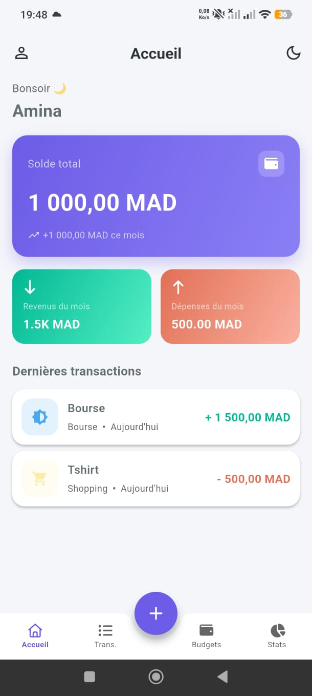 | 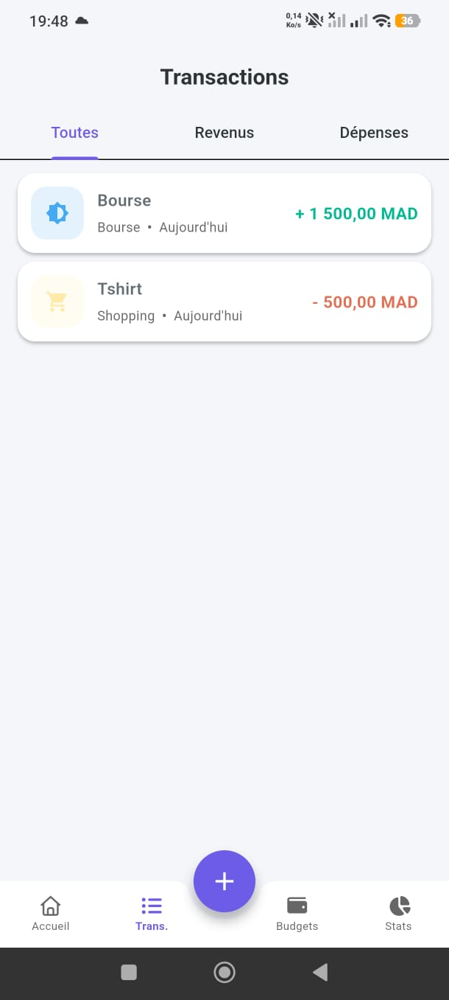 |

| Revenus | Dépenses |
|:---:|:---:|
| 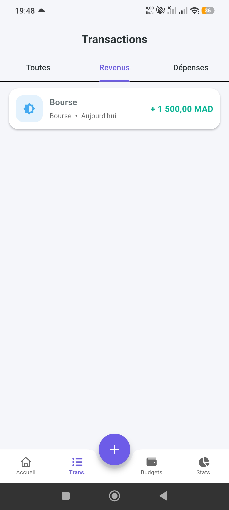 | 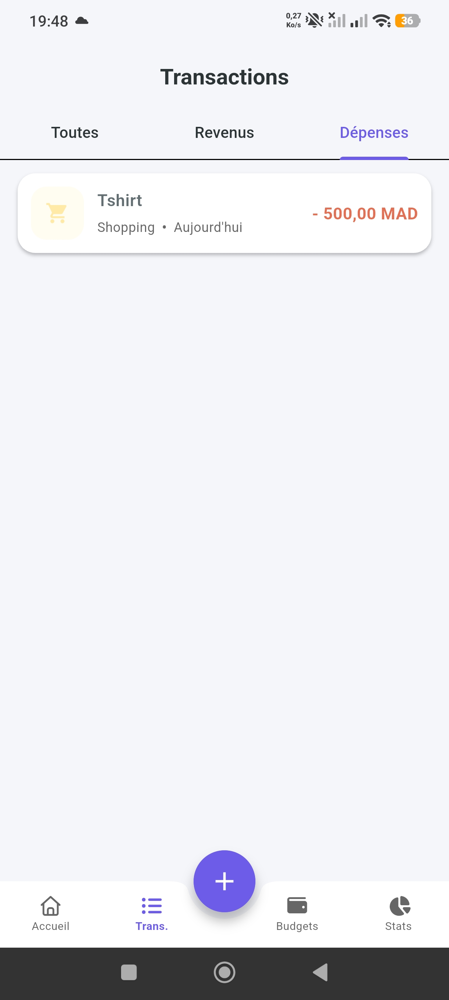 |

### ➕ Ajout de transaction

| Ajouter une dépense | Ajouter un revenu |
|:---:|:---:|
| 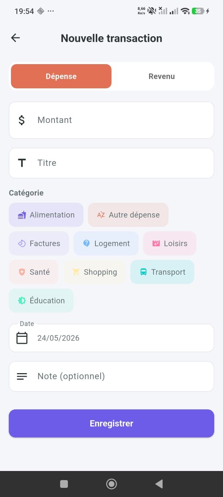 | 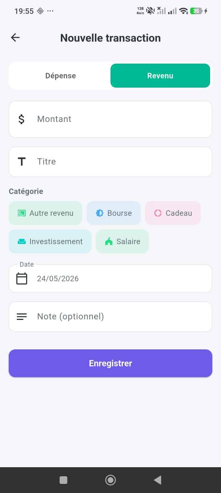 |

### 💼 Budgets

| Liste des budgets | Créer un budget | Alerte en cas de dépassement de budget
|:---:|:---:|:---:|
| 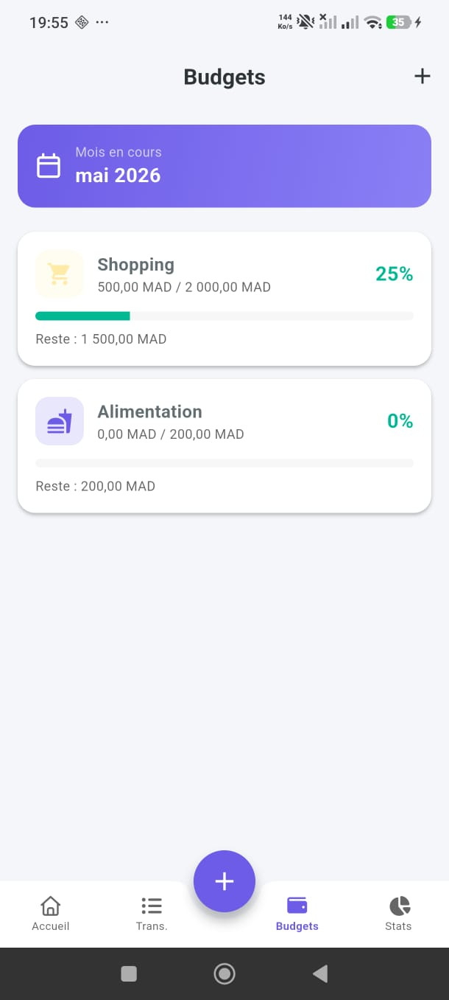 | 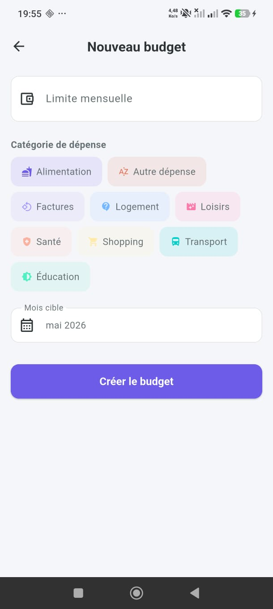 |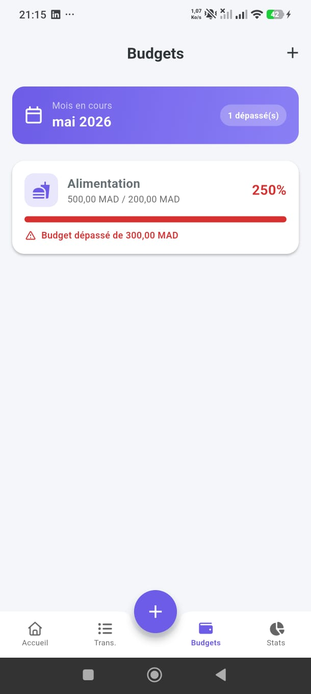 |
### 📈 Statistiques

| Graphique camembert | Évolution mensuelle |
|:---:|:---:|
| 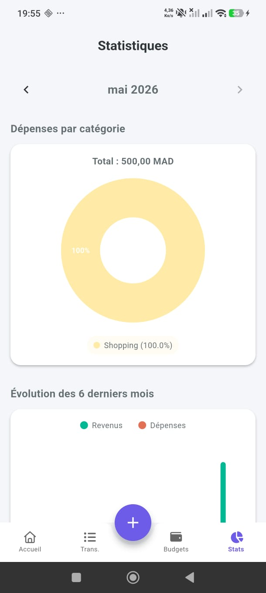 | 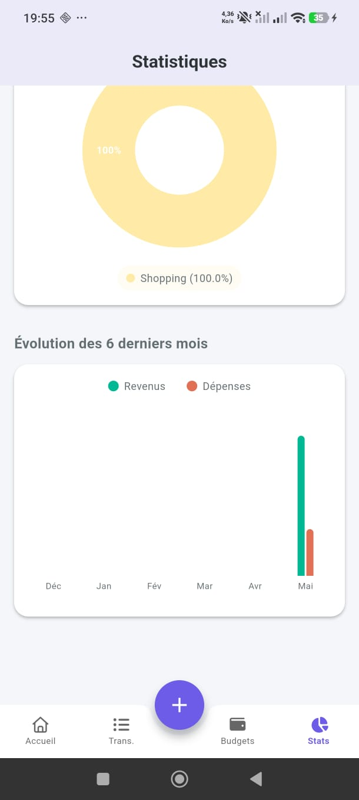 |

### 👤 Profil

| Mon profil | Changer le mot de passe |
|:---:|:---:|
| 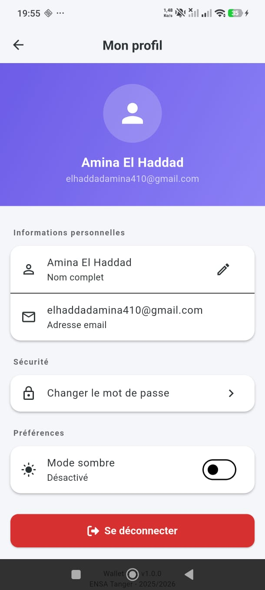 |  |

### 🌙 Mode sombre

| Vue 1 | Vue 2 | Vue 3 | Vue 4 |
|:---:|:---:|:---:|:---:|
| 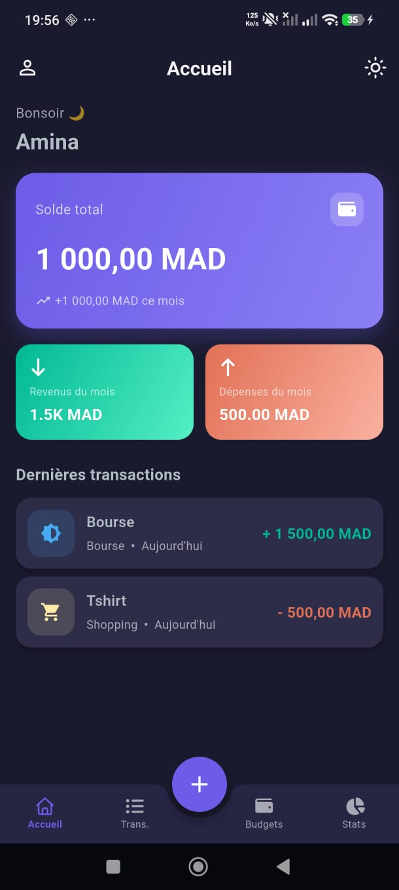 | 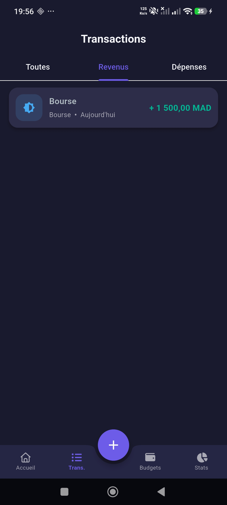 | 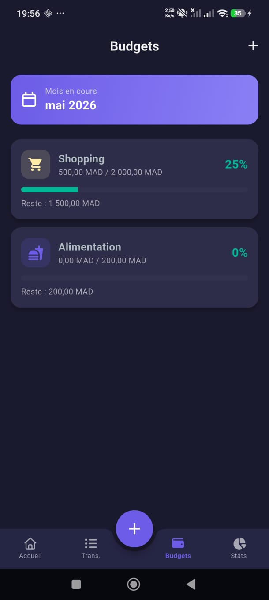 | 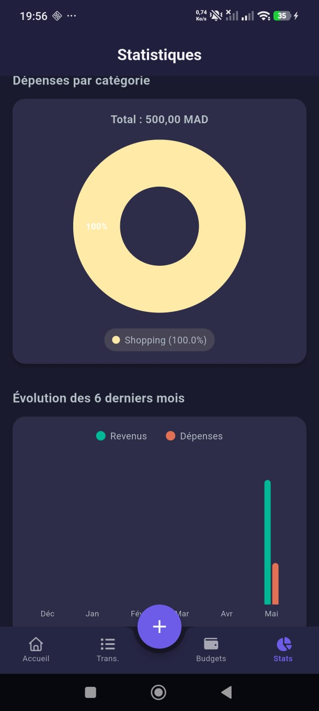 |

---

## 🚀 Installation et exécution

### Prérequis

- **Flutter SDK** ≥ 3.19 ([Installation officielle](https://docs.flutter.dev/get-started/install))
- **Dart SDK** ≥ 3.3 (inclus avec Flutter)
- **Android Studio** ou **VS Code** avec extension Flutter
- Un **émulateur Android** ou un **smartphone physique** (Android 5.0+, API 21+)
- **JDK 17 ou plus**

### Étape 1 — Récupérer le projet

```bash
# Via Git
git clone https://github.com/aminael24/wallet_app.git
cd wallet_app

# Ou décompresser le fichier ZIP fourni
```

### Étape 2 — Installer les dépendances

```bash
flutter pub get
```

### Étape 3 — Vérifier l'environnement Flutter

```bash
flutter doctor
```

Toutes les checkboxes liées à Android doivent être validées (✓).

### Étape 4 — Lancer l'application

#### Sur smartphone physique (recommandé) :

1. Activer les **Options développeurs** (Paramètres → À propos → 7 taps sur "Numéro de build")
2. Activer le **Débogage USB**
3. Brancher le téléphone au PC
4. Vérifier la détection : `flutter devices`
5. Lancer :
```bash
flutter run
```

#### Sur émulateur Android :

```bash
flutter run
```

#### Pour générer un APK release :

```bash
flutter build apk --release
```

L'APK sera disponible dans `build/app/outputs/flutter-apk/app-release.apk`.

> 📌 En cas de problème (cache Gradle, émulateur offline, etc.), consultez [`SETUP.md`](SETUP.md).

### Étape 5 — Première utilisation

1. Créez un compte via l'écran **Inscription** :
   - Nom complet
   - Email valide
   - Mot de passe (min. 6 caractères, au moins 1 chiffre)
2. Les 14 catégories par défaut sont automatiquement créées.
3. Ajoutez votre première transaction via le bouton **+** central.
4. Définissez des budgets mensuels par catégorie depuis l'onglet **Budgets**.
5. Visualisez vos statistiques dans l'onglet **Stats**.

---

## 📁 Structure du projet

```
wallet_app/
├── android/                       # Configuration Android native
├── assets/                        # Ressources statiques
├── docs/                          # Documentation et captures d'écran
│   ├── ARCHITECTURE.md           # Architecture MVC détaillée
│   └── screenshots/              # Captures d'écran de l'app
├── lib/
│   ├── main.dart                 # Point d'entrée
│   ├── models/                   # 📦 MODEL
│   │   ├── user_model.dart
│   │   ├── category_model.dart
│   │   ├── transaction_model.dart
│   │   └── budget_model.dart
│   ├── views/                    # 🖼️ VIEW
│   │   ├── auth/
│   │   │   ├── splash_screen.dart
│   │   │   ├── login_screen.dart
│   │   │   └── register_screen.dart
│   │   ├── home/
│   │   │   ├── main_screen.dart
│   │   │   └── home_screen.dart
│   │   ├── transactions/
│   │   │   ├── transactions_screen.dart
│   │   │   ├── add_transaction_screen.dart
│   │   │   └── transaction_detail_screen.dart
│   │   ├── budgets/
│   │   │   ├── budgets_screen.dart
│   │   │   └── add_budget_screen.dart
│   │   ├── statistics/
│   │   │   └── statistics_screen.dart
│   │   └── profile/
│   │       └── profile_screen.dart
│   ├── controllers/              # 🎮 CONTROLLER
│   │   ├── auth_controller.dart
│   │   ├── theme_controller.dart
│   │   ├── transaction_controller.dart
│   │   ├── category_controller.dart
│   │   └── budget_controller.dart
│   ├── services/                 # 🔧 SERVICE (DAO)
│   │   ├── database_helper.dart
│   │   ├── auth_service.dart
│   │   ├── category_service.dart
│   │   ├── transaction_service.dart
│   │   └── budget_service.dart
│   ├── widgets/                  # 🧩 Widgets réutilisables
│   │   ├── transaction_list_item.dart
│   │   └── empty_state.dart
│   └── utils/                    # 🛠️ Utilitaires
│       ├── app_colors.dart
│       ├── app_theme.dart
│       ├── app_constants.dart
│       ├── app_formatters.dart
│       ├── app_provider.dart
│       └── validators.dart
├── test/
│   └── validators_test.dart      # Tests unitaires
├── pubspec.yaml
├── README.md
└── SETUP.md
```

---

## 🗄️ Schéma de la base de données SQLite

```sql
users (
  id, full_name, email UNIQUE, password_hash, created_at
)

categories (
  id, user_id → users(id) CASCADE,
  name, type ('income'/'expense'),
  icon_code_point, color_index
)

transactions (
  id, user_id → users(id), category_id → categories(id),
  amount, type, title, note, date, created_at
)

budgets (
  id, user_id, category_id,
  limit_amount, month, year, created_at,
  UNIQUE(user_id, category_id, month, year)
)
```

---

## 👥 Équipe

- **EL HADDAD Amina** — `elhaddad.amina@etu.uae.ac.ma` — GitHub : [@aminael24](https://github.com/aminael24)

**Encadrant :** Pr. TBATOU Zakaria

**Année universitaire :** 2025/2026

**Établissement :** École Nationale des Sciences Appliquées (ENSA) — Tanger

**Filière :** 2ème année cycle ingénieur en génie informatique

---

## 📄 Licence

Projet académique réalisé dans le cadre du mini-projet Flutter.

---
